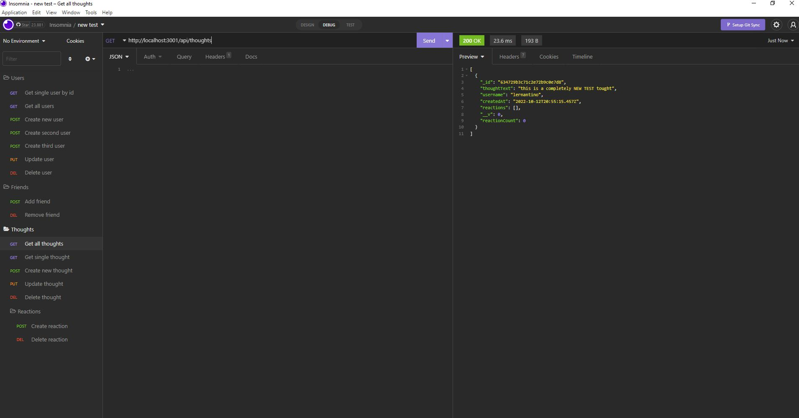

# 18-Social-Network-API

This is a basic social network application where users can share their thoughts, react to friends' thoughts and create a friend's list (to be understood more like a follower list).

## Installation and Use

After cloning the app, run npm i in your terminal to install the necessary packages and dependencies. Afterwards run `npm start` or `npm run dev` in your terminal. To test the routes, navigate to Insomnia or Postman.

## Technologies used

This app was built with

- JavaScript
- NodeJS
- Express.js
- MongoDB
- Mongoose

## Screenshot

The following screenshot is supposed to serve as an overview of the different CRUD operations that are part of the app. Please also refer to the video which is linked at the end of this readme to view them in use.

## Links

- [GitHub Repository](https://github.com/HenniePenny/18-Social-Network-API)
- [Link to walkthrough video](https://drive.google.com/file/d/13lrQ6BV92CyfTgfJRYLFlJaLwr9GWlNW/view)
